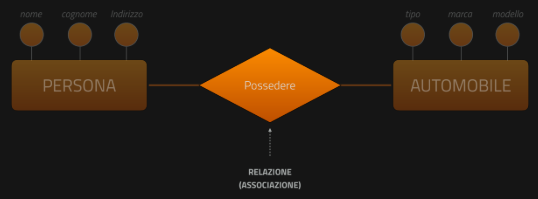

# Il modello relazionale
* La **tabella** è la struttura dati fondamentale di un database relazionale;
* Con la tabella si rappresentano le **entità** e le **relazioni** del modello concettuale;
* La tabella è composta da campi (colonne o **attributi**) e da record (righe o **tuple**);
* Ogni **campo** rappresenta un **attributo** dell'entità/relazione;
* Per ogni campo viene individuato un suo **dominio** (**tipo di dati**): alfanumerico, numerico, data, ...;
* Ogni **record** rappresenta una **istanza** (o occorrenza o **tupla**) dell'entità/relazione;
* Garantisce l'**integrità referenziale**;
**Modello concettuale**: trasformazione di **specifiche** in linguaggio naturale (che definiscono la realtà descritta dal DB) in uno schema grafico chiamato **Diagramma E-R** che utilizza due concetti fondamentali: **Entità** e **Associazione/Relazione**.

## Progettazione
### Modello Concettuale
**Definizione**: rappresenta i dati e le loro relazioni a un livello astratto, senza preoccuparsi di dettagli tecnici o implementativi.  
**Obiettivo**: descrivere la struttura dei dati in modo comprensibile per utenti e analisti, senza vincoli tecnologici.  
**Strumento tipico**: diagrammi Entity-Relationship (ER) o UML class diagrams (Unified modeling language).  
**Indipendenza dal DBMS**: questo modello non dipende dal database relazione, NoSQL o altro.  
  
### Modello logico
**Definizione**: traduce il modello concettuale in una struttura più dettagliata e aderente alle regole di un particolare tipo di database (es. relazionale);  
**Obiettivo**: definire tabelle, attributi, chiavi primarie e chiavi esterne, mantenendo ancora un livello di astrazione dalla tecnologia specifica;  
**Strumento tipico**: schema relazione (tabelle, colonne, vincoli);  
**Dipendenza dal tipo di database**: nel caso del modello relazionale, si definiscono relazioni tra tabelle con chiavi primarie e chiavi esterne;  
  
### Modello fisico
**Definizione**: rappresenta la struttura effettiva del database come verrà implementata su un determinato DBMS;  
**Obiettivo**: ottimizzare il database per le prestazioni, definendo dettagli come tipi di dati specifici, indici, partizionamento, ecc;  
**Strumento tipico**: DDL (Data Definition Language) SQL per creare tabelle, vincoli, indici;  
**Dipendenza dal DBMS**: strettamente legato a un DBMS specifico (es. MySQL, PostgreSQL, Oracle).  
  
## Fasi della progettazione
**Modello Concettuale**: rappresenta i dati e le loro relazioni a un livello astratto, senza preoccuparsi di dettagli tecnici o implementativi.  
--->  
**Modello Logico**: traduce il modello concettuale in una struttura più dettagliata e aderente alle regole di un particolare tipo di database.  
--->  
**Modello Relazionale**: rappresenta la struttura effettiva del database come verrà implementata su un determinato DBMS.  
  
## Diagramma E-R, simboli
### Entità
Concetto fondamentale, generale, per la realtà che si sta modellando.  
Rappresenta **classi di oggetti** che hanno **proprietà comuni** ed **esistenza autonoma** ai fini dell'applicazione di interesse.
* Identificata da un rettangolo  --->  
  
### Attributi
**Caratteristiche specifiche di un'entità**, utili (o necessarie) nella realtà da modellare
* Identificata da un cerchio collegato all'entità  --->  
L'insieme di attributi che garantisce **l'univocità** delle istanze di un'entità è detta **Chiave Primaria**.  
E' indicata come: **PRIMARY KEY** o PK.  
  
Identificata graficamente con un cerchio pieno collegato all'entità e relativo nome attributo sottolineato.  --->    
  
#### Caratteristiche
* L'insieme dei campi i cui valori identificano univocamente un record all'interno di una tabella è detto Chiave Primaria. Quando la chiave primaria è composta un solo campo, si parla di campo chiave.
* Quando non è possibile trovare un campo chiave tra gli attributi di una entità, si definisce un campo univoco di tipo numerico che si auto-incrementa (contatore): ID (identifier).  
Esempi di campo chiave: matricola, codice fiscale, etc...  
   
#### Istanze di un'entità
Specifici dati, oggetti appartenenti ad un'entità
* non sono rappresentate nel Diagramma E-R ma si intendono contenute in ogni entità;
* Carlo, Rossi, via Verdi e un'**istanza** dell'**entità ALUNNO (attributi: Nome, Cognome, Indirizzo)**  --->    
  
Possiamo considerare le entità come sistemi all'interno dei quali sono contenuti oggetti (le istanze) ciascuno con specifiche caratteristiche (valore degli attributi)  
   
### Relazioni (Associazioni)
Collegamenti logici che uniscono due o più entità nella realtà descritta dal database
* identificata da un rombo collegato alle due entità
