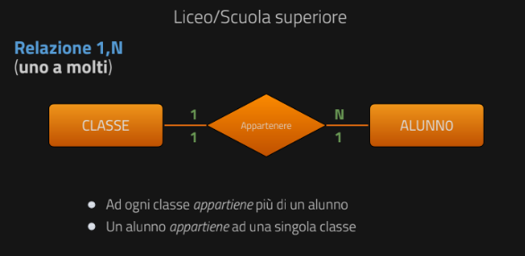

# Cardinalità delle relazioni
La relazione R che lega due entità E1 ed E2 può essere classificata in base alla sua **cardinalità**:
* 1,1 (**uno a uno**) se da un elemento E1 può corrispondere un solo elemento di E2;

* 1,N (**uno a molti**) se ad un elemento E1 possono corrispondere più di un elemento di E2, ad un elemento di E2 può corrispondere un solo elemento di E1;

* N,N (**molti a molti**) se ad ogni elemento di E1 possono corrispondere molti elementi di E2 e viceversa.
