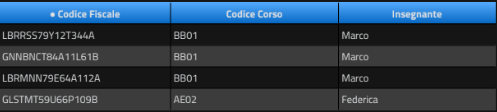
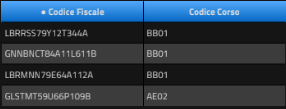

# Normalizzazione del database
## La prima forma normale (1NF)
Si dice che un database è in 1NF se per ogni tabella/relazione contenuta nella base dati:
* tutte le tuple della relazione hanno lo stesso numero di attributi;
* non presenta gruppi di attributi che si ripetono (ossia ciascun attributo è definito su un dominio con valori atomici);
* tutti i valori di un attributo sono dello stesso tipo (appartengono allo stesso dominio);
* esiste una chiave primaria (ossia esiste un attributo o un insieme di ttributi che identificano in modo univoco ogni tupla della relazione);
* l'ordine delle righe è irrilevante (non è portatore di informazioni).
  
### esempio
Facciamo un esempio di una tabella che, sepput minuta di una chiave primaria non può essere considerata in forma normale:  

La tabella qui sopra NON è in 1NF in quanto, pur avendo una chiave primaria, presenta un attributo (dettagli) che non contiene dati in forma atomica, ma un gruppo di attributi.  
Dunque:  
  
  
Atro esempio  
 La tabella di fianco NON è in 1NF in quanto, ogni colonna deve assumere un solo valore, ovvero non può essere una matrice o un'array di valori.  
 In questo caso la normalizzazione consiste nel riportare le celle che originariamente erano raggruppate in una unica colonna in più righe replicando gli altri valori.  
  
## La seconda forma normale (2NF)
Perchè una base dati possa essere in 2NF è necessario che:
* si trovi già in 1NF;
* tutti gli attributi non chiave dipendano dall'intera chiave primaria (e non solo da una parte di essa)
  
### esempio
Ora la tabella precedente che ripetta la 1NF non rispetta però la 2NF  
 La chiave primaria è la combinazione (Id, Corso).  
L'attributo "Nome" dipende solo da Id, non da tutto l'insieme (Id, Corso).  
Quindi c'è una dipendenza parziale --> violazione della 2NF.  
Soluzione scomposizione in due tabelle  
      
  
### La terza forma normale (3NF)
Un database è in 3NF se:
+ è già in 2NF (e quindi, necessariamente, anche 1NF);
* tutti gli attributi non chive dipendono direttamente dalla chiave, quindi non ci sono attributi "non chiave" che dipendono da altri attributi "non chiave"  
  
### esempio
Supponiamo di avere una base dati di una palestra in cui il codice fiscale dell'iscritto al corso frequentato è associato all'insegnante di riferimento.  
Si supponga che il nostro DB abbia un'unica chiave primaria ("Codice fiscale") e sia così strutturato:  
  
Il nostro database non è in 3NF in quanto il campo "insegnante" non dipende dalla chiave primaria ma dal campo "Codice Corso" (che non è chiave).  
Per normalizzare il nostro DB in 3NF dovremo scomporlo in due tabelle:  
  