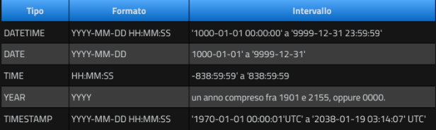

# Tipi di dato
In una tabella MYSQL per ciascuna colonna possiamo definire diversi tipi di dato (dominio):
* Numerics (numeri interi e a virgola mobile);
* String (stringa);
* Date, Time (data e ora);
* JSON
  
## Dati numerici: interi
  
E' importante precisare che se all'interno di un campo di tipo numerico si cerca di inserire un valore maggiore di quanto ammesso dal tipo prescelto, MySQL produrrà un errore.  
  
## Tipi di numeri in virgola mobile 
  
  
## Dati stringa
  
I tipi **char** e **varchar** sono sicuramente i tipi più utilizzati.  
La differenza tra quest due tipi è data dal fatto che char ha **lunghezza fissa**, varchar ha **lunghezza variabile**.  
Questo significa che in una colonna char(10) tutti i valori memorizzati occuperanno lo **spazio massimo** anche se costituiti da 3 soli caratteri.  
  
I tipi **text** e **blob** (Binary Large Object) consentono di memorizzare grandi quantità di dati:
* text è utilizzato per dati di tipo testuale;
* blob è utilizzato per ospitare dati binary (ad esempio la sorgente di un'immagine).  
  
I tipi **binary** e **varbinary** sono simili a char e varchar, tranne per il fatto che **memorizzano stringhe binarie** anzichè stringhe non binarie: memorizzano stringhe di byte anzichè stringhe di caratteri.  
  
I tipi **enum** e **set** sono un tipo di dato di testo in cui le colonne possono avere solo dei valori predefiniti.  
**enum**: tipo di dato enumerazione.  
Contiene un insieme di valori prefissati tra cui scegliere si può inserire solamente uno dei valori previsti.  
I valori sono inseriti tra parentesi (elenco separato da virgola) dopo la dichiarazione ENUM.  
genere ENUM('f', 'm', 'nb')  
La colonna genere accetterà solamente i valori f, m o nb. Se proviamo a mettere un valore diverso con il comando insert, mysql restituirà errore.  
**set**: è una estensione di enum  
interessi SET('a', 'b', 'c', 'd')  
come per enum i valori sono fissi e disposti dopo la dichiarazione set, tuttavia, le colonne set possono assumere più di un valore tra quelli previsti.  
  
**DateTime**: tali tipi di dati sono molto utili quando si ha a che fare con informazioni riguardanti la data e l'orario.  
Di seguito una tabella riepilogativa  
  
I campi di tipo datetime contengono sia la data che l'orario. I valori all'interno di questi campi possono essere interiti sia sotto forma di stringhe che di numeri.  
MySQL interpreta i valori dell'anno a 2 cifre utilizzando queste regolee:  
* i valori dell'anno nell'intervallo 00-69 diventano 2000-2069
* i valori dell'anno nell'intervallo 70-99 diventano 1970-1999
Sia **datetime** sia **timestamp** possono memorissare in automatico la data.  
Per ottenere ciò in fase di definizione del campo bisogna impostare il valore di default di memorizzazione (es):  
ins timestamp default current_timestamp on update current_timestamp  
data datetime default current_timestamp on update current_timestamp  
## timestamp
Il tipo timestamp memorizza data e ora insieme al fuso orario del server.  
Quando memorizzi un valore in una colonna timestamp, mysql lo converte automaticamente nel fuso orario UTC (Coordinated Universal Time) e lo memorizza in quel formato. Quando lo leggi, il valore viene riconvertito nel fuao orario del server o in quello del client (se configurato).  
Questo rende il timestamp utile quando devi mostrare gli stessi dati e ora a utenti in fusi orari diversi, poichè mysql gestisce automaticamente la conversione da e verso UTC.  
Timestamp copre solo il range di date da 1970-01-01 00:00:01 UTC fino a 2038-01-19 03:14:07 UTC  
Se hai bisogno di memorizzare date al di fuori di questo intervallo, non è adatto.  
## datetime
