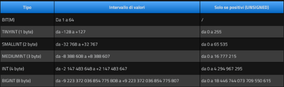
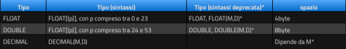
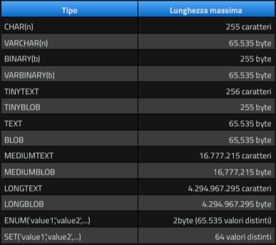

# Tipi di dato
In una tabella MYSQL per ciascuna colonna possiamo definire diversi tipi di dato (dominio):
* Numerics (numeri interi e a virgola mobile);
* String (stringa);
* Date, Time (data e ora);
* JSON
  
## Dati numerici: interi
  
E' importante precisare che se all'interno di un campo di tipo numerico si cerca di inserire un valore maggiore di quanto ammesso dal tipo prescelto, MySQL produrrà un errore.  
  
## Tipi di numeri in virgola mobile 
  
  
## Dati stringa
  
I tipi **char** e **varchar** sono sicuramente i tipi più utilizzati.  
La differenza tra quest due tipi è data dal fatto che char ha **lunghezza fissa**, varchar ha **lunghezza variabile**.  
Questo significa che in una colonna char(10) tutti i valori memorizzati occuperanno lo **spazio massimo** anche se costituiti da 3 soli caratteri.  
  
I tipi **text** e **blob** (Binary Large Object) consentono di memorizzare grandi quantità di dati:
* text è utilizzato per dati di tipo testuale;
* blob è utilizzato per ospitare dati binary (ad esempio la sorgente di un'immagine).  
  
I tipi **binary** e **varbinary** sono simili a char e varchar, tranne per il fatto che **memorizzano stringhe binarie** anzichè stringhe non binarie: memorizzano stringhe di byte anzichè stringhe di caratteri.  
  
I tipi **enum** e **set** sono un tipo di dato di testo in cui le colonne possono avere solo dei valori predefiniti.  
enum: tipo di dato enumerazione