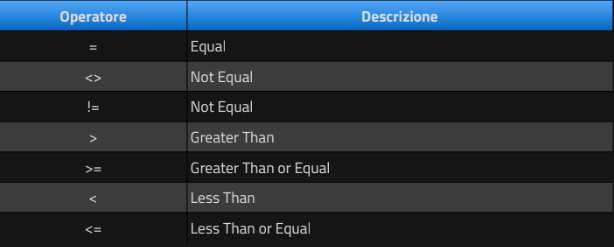

# Query 
## Interrogazione dei dati 
**Creazione di query di base** 
Abbiamo già introdotto il comando SELECT per visualizzare i record inseriti in una tabella  
    <pre>SELECT field1, field2, field3 FROM tableName;</pre>
Utilizzando il carattere jolly * selezioniamo tutte le colonne dei campi di dati da visualizzare  
    <pre>SELECT * FROM tableName;</pre>
  
## ORDER BY
Consente di ordinare i risultati di una query.  
L'istruzione ORDER BY è seguita dal(dai) campo(i) su cui si basa l'ordinamento.  
L'ordine predefinito è crescente (**ASC**)  
    <pre>
        SELECT *
        FROM studenti
        ORDER BY cognome;
    </pre>
Usando l'istruzione **DESC** si ordina in modo decrescente:
    <pre>
        SELECT *
        FROM studenti
        ORDER BY cognome DESC;
    </pre>
Se si vuole ordinare per nome con ordinamento DESC e per eta con ordinamento ASC dobbiamo scrivere: 
    <pre>
        SELECT *
        FROM studenti
        ORDER BY cognome DESC, eta;
    </pre>
  
## LIMIT
Consente di definire il numero dei record massimo da visualizzare.  
Accetta due argomenti: [i], opzionale, specifica l'indice da cui partire per mostrare i record.  
Il secondo argomento indica la quantità di record da mostrare:  
    <pre>
        SELECT *
        FROM tableName
        ORDER BY field
        LIMIT [i],10;
    </pre>
La query seguente mostra solo i primi 10 record della tabella studente: 
    <pre>
        SELECT *
        FROM studenti
        ORDER BY cognome
        LIMIT 10;
    </pre>
La query seguente mostra 10 record della tabella studente presi a partire dall'undicesimo record.  
Ricordate che l'indice parte da 0, per cui l'undicesimo record è l'indice numero 10.  
    <pre>
        SELECT *
        FROM studenti
        ORDER BY cognome
        LIMIT 10 , 10;
    </pre>
  
## SELECT e WHERE
**WHERE** consente di filtrare i risultati di una query, mostrando solo i record che soddisfano la condizione imposta.  
Se vogliamo selezionare il nome e cognome degli studenti di genere maschile possiamo applicare un filtro sull'attributo genere come condizione del **WHERE** grazie all'uso degli **operatori**.  
    <pre>
        SELECT nome, cognome
        FROM studenti
        WHERE genere = 'm';
    </pre>
  
## Operatori
### Operatori di confronto 

    <pre>
        SELECT nome, cognome, email, data_nascita
        FROM studenti
        WHERE genere = 'f'
        ORDER BY cognome, nome;
    </pre>
    <pre>
        SELECT nome, cognome, email, data_nascita
        FROM studenti
        WHERE citta <> 'torino'
        ORDER BY cognome, nome;
    </pre>
    <pre>
        SELECT nome, cognome, email, data_nascita
        FROM studenti
        WHERE data_nascita >= '1989-12-31'
        ORDER BY data_nascita;
    </pre>
  
### Operatori logici: AND e OR
Quando si utilizza l'operatore AND **tutte le condizioni** devono essere vere.  
    <pre>
        SELECT field(s)
        FROM tableName
        WHERE condition1 AND condition2 AND condition3;
    </pre>
    <pre>
        SELECT nome, cognome, email, data_nascita
        FROM studenti
        WHERE genere = 'm' AND provincia = 'to';
    </pre>
Vengono filtrati i record degli studenti maschi provenienti dalla provincia di Torino.
  
Quando si utilizza l'operatore OR **almeno una delle condizioni** deve essere vera.
    <pre>
        SELECT nome, cognome, email, data_nascita
        FROM studenti
        WHERE genere = 'm' OR provincia = 'to';
    </pre>
Vengono filtrati i record degli studenti maschi e degli studenti che provengono dalla provincia di Torino.  
Attenzione: l'operatore AND **ha precedenza** su OR, quindi è consigliabile usare le parentesi per una migliore leggibilità.  
  
## Operatori logici: NOT
L'operatore NOT **nega** le condizioni poste.  
Questa query seleziona alcuni attributi degli studenti il cui genere **non** è 'm'
    <pre>
        SELECT nome, cognome, email, data_nascita
        FROM studenti
        WHERE NOT genere = 'm';
    </pre>
Questa quert seleziona alcuni attributi degli studenti il cui genere non è 'm' e la cui provincia è 'to'
    <pre>
        SELECT nome, cognome, email, data_nascita
        FROM studenti
        WHERE NOT genere = 'm' AND provincia = 'to';
    </pre>
Questa query seleziona alcuni attributi degli studenti il cui genere **non** è 'm' e la cui provincia **non** è 'to'
    <pre>
        SELECT nome, cognome, email, data_nascita
        FROM studenti
        WHERE NOT genere = 'm' AND NOT provincia = 'to';
    </pre>
Se volete negare una o più condizioni è preferibile usare l'operatore <> o !=, il NOT può confondere e rendere meno leggibile la query.  
  
## Operatori di confronto avanzati
### IN, NOT IN
L'operatore **IN** ci consente di selezionare i record indicando più valori di campo.  
Possiamo farlo con l'operatore OR, ma può diventare complicato quando confrontiamo molti valori.  
Prendiamo ad esempio l'esecuzione di una query in cui cerchiamo solo gli studenti di alcune province:
    <pre>
        SELECT nome, cognome, email, data_nascita, provincia
        FROM studenti
        WHERE provincia IN ('to','cn','at','no');
    </pre>
L'operatore **NOT IN** funziona in modo simile a IN, mostra i record che NON contengono i valori selezionati.  
Così la seguente query mostrerà tutti i record di studenti che non appartengono alle province in elenco.
    <pre>
        SELECT nome, cognome, email, data_nascita, provincia
        FROM studenti
        WHERE provincia NOT IN ('to','cn','at','no');
    </pre>
**ATTENZIONE**: NOT IN non considera i valori NULL, se si cercano anche queli bisogna aggiungere ulteriore condizione.  
  
### BETWEEN, NOT BETWEEN
Utilizzando l'operatore **BETWEEN** possiamo selezionare un intervallo di valori. I valori di inizio e fine dell'intervallo sono inclusi. I valori dell'intervallo possono essere numeri, testo o date.  
**ATTENZIONE**: NOT BETWEEN non considera i valori NULL.
    <pre>
        SELECT nome, cognome, email, data_nascita
        FROM studenti
        WHERE data_nascita BETWEEN '1985-01-01' AND '1994-12-31';
    </pre>
  
### IS NULL, IS NOT NULL
L'operatore **IS NULL** viene utilizzato per visualizzare i record che non hanno un valore impostato per un campo.  
Viceversa **IS NOT NULL** mostra i record che hanno un valore impostato per un campo.
    <pre>
        SELECT nome, cognome, email, data_nascita
        FROM studenti
        WHERE data_nascita IS NULL;
    </pre>
Questi operatori possono essere utilizzati per trovare i record che hanno bisogno di informazioni aggiuntive.  
  
### LIKE, NOT LIKE
L'operatore **LIKE** permette di effettuare ricerche testuali con pattern matching.  
**ATTENZIONE**: NOT LIKE non considera i valori NULL
    <pre>SELECT * FROM studenti WHERE cognome LIKE 'v%';</pre>
    <pre>SELECT * FROM studenti WHERE nome LIKE '%a';</pre>
    <pre>SELECT * FROM studenti WHERE indirizzo LIKE 'via %';</pre>
    <pre>SELECT * FROM studenti WHERE email LIKE '%gmail.com';</pre>
    <pre>SELECT * FROM studenti WHERE nome LIKE 'paol_';</pre>
    <pre>SELECT * FROM studenti WHERE nome LIKE '_a%';</pre>
La differenza è data dalla posizione del carattere percentuale (%) che sta ad indicare "qualsiasi carattere dopo" e "qualsiasi carattere prima".  
L'uso di underscore indica un solo carattere.  
  
### REGEXP_LIKE() (REGEXP e RLIKE sono sinonimi di REGEXP_LIKE())
Un operatore più potente di LIKE è **REGEXP** il quale consente di utilizzare molti più simboli per ricerche più complesse.
    <pre>SELECT * FROM studenti WHERE REGEXP_LIKE(nome,'ra'); SELECT * FROM studenti WHERE nome REGEXP 'ra';</pre>
    <pre>SELECT * FROM studenti WHERE nome REGEXP '^mar';</pre>
    <pre>SELECT * FROM studenti WHERE nome REGEXP 'co$';</pre>
    <pre>SELECT * FROM studenti WHERE nome REGEXP 'mar|ara|ola';</pre>
Potete combinare i simboli
    <pre>SELECT * FROM studenti WHERE nome REGEXP '^mar|ara|co$';</pre>
    <pre>SELECT * FROM studenti WHERE nome REGEXP '^(mar|ara)|co$'; -- comincia per 'mar' o 'ara' o finisce con 'co'</pre>
Creare conbinazioni di pattern
    <pre>SELECT * FROM studenti WHERE nome REGEXP '[mcp]a';</pre>
    <pre>SELECT * FROM studenti WHERE nome REGEXP 'a[ero]';</pre>
    <pre>SELECT * FROM studenti WHERE nome REGEXP 'l[ao]$';</pre>
    <pre>SELECT * FROM studenti WHERE nome REGEXP '^[a-m]'; -- '^[n-z]'</pre>
  
## Operatori matematici
MySQL supporta i classici operatori matematici tradizionali, cioè:
* '+' (addizione)
* '-' (sottrazione)
* '*' (moltiplicazione)
* '/' (divisione)
* '%' (modulo)
Questi operatori risultano molto utili quando, ad esempio, si devono svolgere dei calcoli all'interno di una SELECT.  
Per fare un esempio si supponga di voler restituire il valore dato dalla sottrazione di due campi.
    <pre>
        SELECT (field1 - field2)
        FROM tableName
        [WHERE condition(s)];
    </pre>
Potete eseguire dei calcoli matematici con SELECT:
    <pre>SELECT 6 / 2 ; ##3</pre>
    <pre>SELECT 35 % 3 ; ##2</pre>
    <pre>SELECT (35 / 3) * 2 ; ##11.6667</pre>